# Spring Boot RabbitMQ Async File Processing Demo

A Spring Boot 3.x + RabbitMQ asynchronous file processing learning project that demonstrates how file uploads can be decoupled from background processing.

The application stores uploaded files separately from their processing jobs, persists metadata and job state in PostgreSQL, and uses RabbitMQ to asynchronously dispatch processing work to consumers.

The project focuses on practical RabbitMQ concepts including **producer/consumer architecture, exchanges, routing keys, durable queues, manual acknowledgements, prefetch, consumer concurrency, delayed retries, dead-letter queues, idempotent processing, and job state management**.


## Table of Contents

* [Architecture](#architecture)
* [Core Concepts](#core-concepts)
* [RabbitMQ Topology](#rabbitmq-topology)
* [Producer and Consumer Flow](#producer-and-consumer-flow)
* [File Storage](#file-storage)
* [Job Lifecycle](#job-lifecycle)
* [Acknowledgement Strategy](#acknowledgement-strategy)
* [Retry with Delayed Queues](#retry-with-delayed-queues)
* [Dead Letter Queue](#dead-letter-queue)
* [Prefetch and Consumer Concurrency](#prefetch-and-consumer-concurrency)
* [Idempotency](#idempotency)
* [Database Model](#database-model)
* [API Documentation](#api-documentation)
* [Configuration](#configuration)
* [Local Setup](#local-setup)
* [Docker Setup](#docker-setup)
* [RabbitMQ Management UI](#rabbitmq-management-ui)
* [Manual Verification](#manual-verification)
* [Synchronous vs Asynchronous Processing](#synchronous-vs-asynchronous-processing)
* [Actuator and OpenAPI](#actuator-and-openapi)
* [Docker Services](#docker-services)
* [License](#license)


## Architecture

The application separates **file upload**, **file storage**, and **background processing**.

The HTTP request is responsible for storing the file, saving metadata, creating the processing job, and publishing a RabbitMQ message.

The actual processing happens asynchronously inside a RabbitMQ consumer.

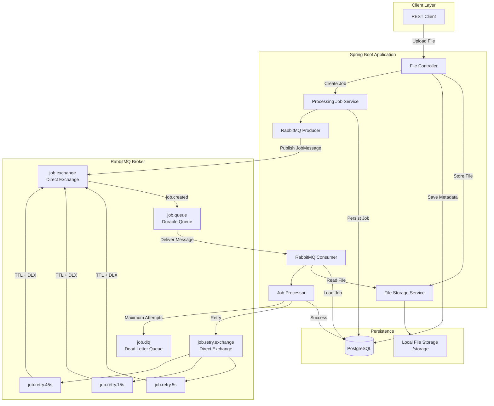

### Architectural Responsibilities

| Component              | Responsibility                               |
| ---------------------- | -------------------------------------------- |
| File Controller        | Accepts file uploads and exposes file APIs   |
| File Storage Service   | Abstracts physical file storage              |
| Local File Storage     | Stores files under `./storage`               |
| Processing Job Service | Creates and manages processing jobs          |
| RabbitMQ Producer      | Publishes processing messages                |
| RabbitMQ Exchange      | Routes messages                              |
| Main Queue             | Holds pending processing messages            |
| Job Consumer           | Receives messages from RabbitMQ              |
| Job Processor          | Performs background processing               |
| PostgreSQL             | Stores file metadata, job state, and history |
| Retry Queues           | Delay failed jobs before another attempt     |
| DLQ                    | Stores jobs that exceeded retry attempts     |


## Core Concepts

This project demonstrates the following asynchronous messaging concepts:

| Concept                  | Implementation                                    |
| ------------------------ | ------------------------------------------------- |
| Producer / Consumer      | RabbitMQ producer and job consumer                |
| Exchange                 | `job.exchange`                                    |
| Routing Keys             | `job.created`, retry and dead-letter routing keys |
| Durable Queues           | Main, retry, and DLQ queues                       |
| Manual ACK               | Explicit `basicAck`                               |
| Prefetch                 | `prefetch: 10`                                    |
| Consumer Concurrency     | 2–5 consumers                                     |
| Delayed Retry            | RabbitMQ TTL queues                               |
| Dead Letter Queue        | `job.dlq`                                         |
| Idempotency              | Job state validation                              |
| Job State Machine        | `QUEUED → PROCESSING → ...`                       |
| File Storage Abstraction | `FileStorageService`                              |
| Database Persistence     | PostgreSQL                                        |
| Database Migration       | Flyway                                            |
| Processing Separation    | File storage is independent of job processing     |


## RabbitMQ Topology

### Exchanges

| Name                 | Type   | Purpose                                             |
| -------------------- | ------ | --------------------------------------------------- |
| `job.exchange`       | Direct | Main exchange used for processing and retry routing |
| `job.retry.exchange` | Direct | Routes failed jobs to delayed retry queues          |

### Queues

| Queue           | Type    | Purpose                           |
| --------------- | ------- | --------------------------------- |
| `job.queue`     | Durable | Main processing queue             |
| `job.retry.5s`  | Durable | First delayed retry               |
| `job.retry.15s` | Durable | Second delayed retry              |
| `job.retry.45s` | Durable | Third delayed retry               |
| `job.dlq`       | Durable | Final destination for failed jobs |

### Routing Keys

| Routing Key     | Destination     | Usage              |
| --------------- | --------------- | ------------------ |
| `job.created`   | `job.queue`     | Initial processing |
| `job.retry.5s`  | `job.retry.5s`  | 5-second retry     |
| `job.retry.15s` | `job.retry.15s` | 15-second retry    |
| `job.retry.45s` | `job.retry.45s` | 45-second retry    |
| `job.dead`      | `job.dlq`       | Final failure      |

### RabbitMQ Message Routing

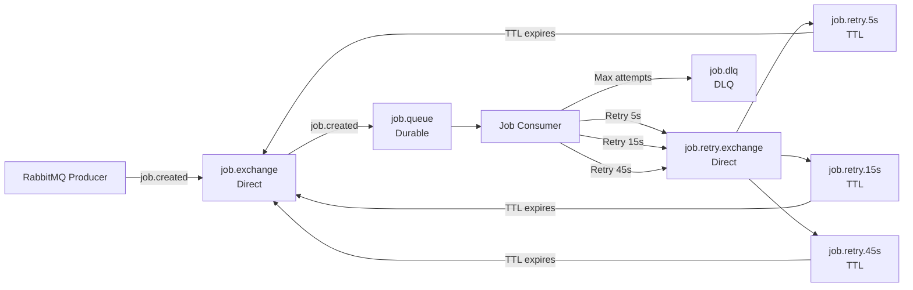


## Producer and Consumer Flow

### Producer Flow

The producer is responsible for dispatching the processing job after the file has been successfully stored.

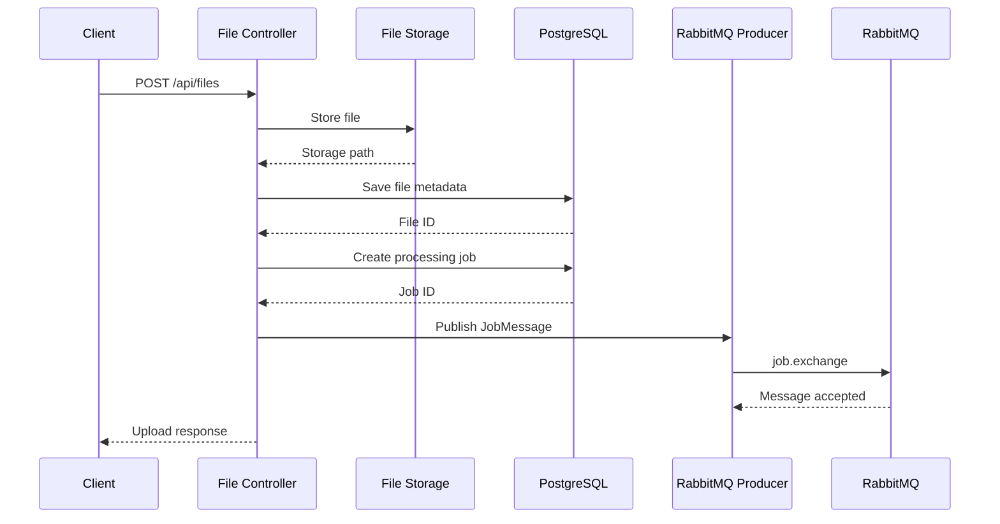

### Consumer Flow

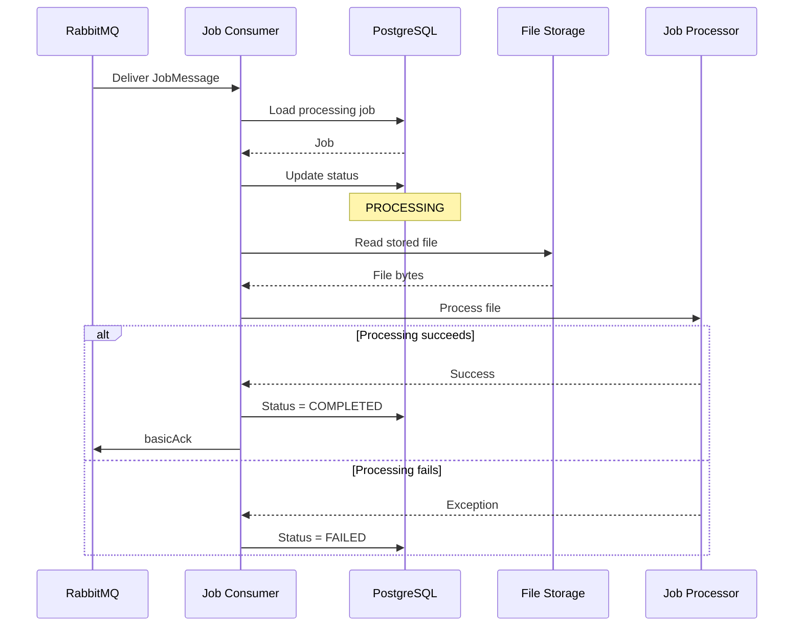


## File Storage

File storage is deliberately separated from the processing pipeline.

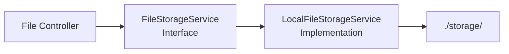

### Storage Flow

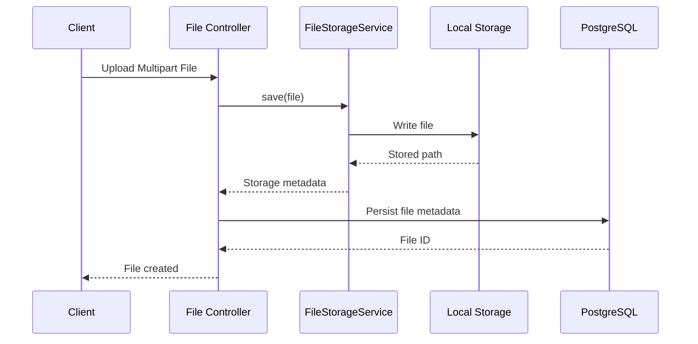

Files are stored with UUID-based filenames.

The application does not use the original filename as the physical storage filename.

The storage abstraction also keeps the application independent of the underlying storage implementation.

The current implementation uses:

```text
./storage/
```

The interface can later be backed by an object-storage implementation such as Amazon S3 without changing the higher-level file-processing flow.


## Job Lifecycle

Each uploaded file can have an associated processing job.

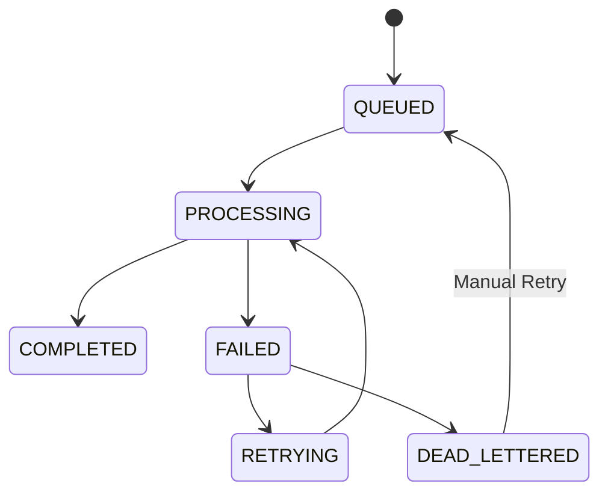

### Valid Transitions

| From            | To              |
| --------------- | --------------- |
| `QUEUED`        | `PROCESSING`    |
| `PROCESSING`    | `COMPLETED`     |
| `PROCESSING`    | `FAILED`        |
| `FAILED`        | `RETRYING`      |
| `FAILED`        | `DEAD_LETTERED` |
| `RETRYING`      | `PROCESSING`    |
| `DEAD_LETTERED` | `QUEUED`        |

Invalid state transitions throw:

```text
InvalidStateTransitionException
```

### Successful Lifecycle

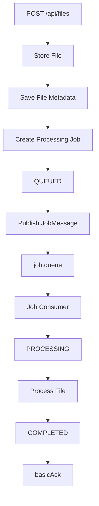


## Acknowledgement Strategy

The consumer uses manual acknowledgement:

```yaml
ackMode: MANUAL
```

RabbitMQ messages are acknowledged explicitly after the application has completed the required processing decision.

### Successful Processing

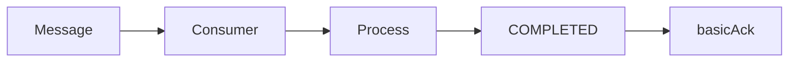

### Retry

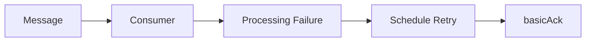

### Dead Letter

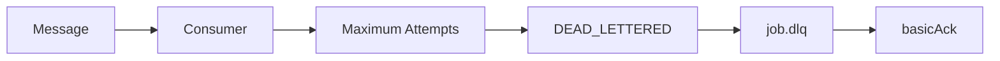

Manual acknowledgement prevents the application from relying on uncontrolled `requeue=true` loops.


## Retry with Delayed Queues

The project uses RabbitMQ TTL queues to implement delayed retries.

| Attempt         |      Delay |
| --------------- | ---------: |
| Attempt 1 → 2   |  5 seconds |
| Attempt 2 → 3   | 15 seconds |
| Attempt 3 → DLQ | 45 seconds |

### Retry Architecture

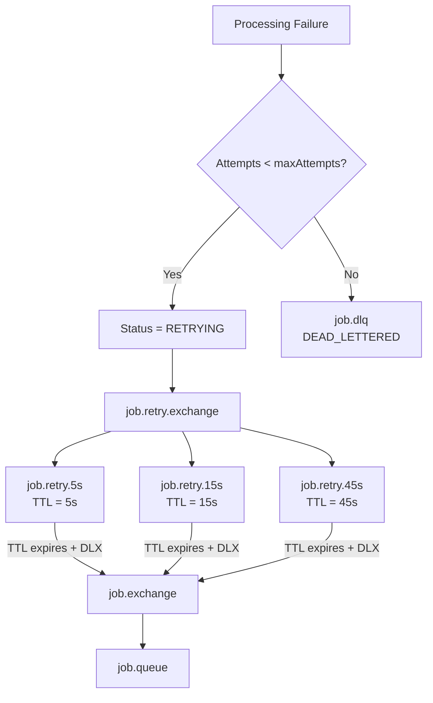

### Retry Lifecycle

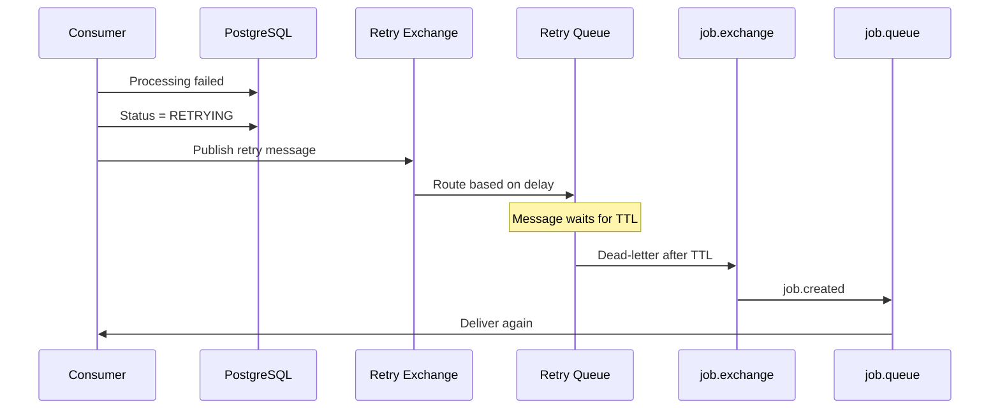

The retry queue delays the message without keeping the original consumer blocked.


## Dead Letter Queue

The DLQ is the final destination for jobs that exceed the configured maximum number of attempts.

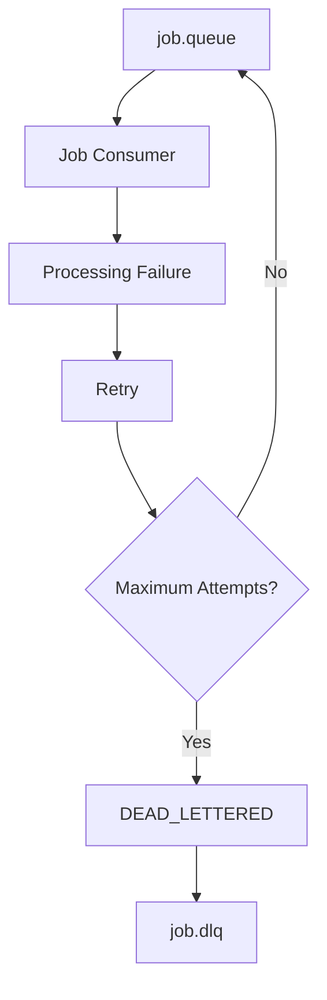

The DLQ provides a controlled destination for messages that cannot be successfully processed.

Jobs that reach this state are stored as:

```text
DEAD_LETTERED
```

They can be manually retried through the API.


## Prefetch and Consumer Concurrency

### Prefetch

The listener is configured with:

```yaml
spring.rabbitmq.listener.simple.prefetch: 10
```

Prefetch controls how many unacknowledged messages RabbitMQ can deliver to an individual consumer.

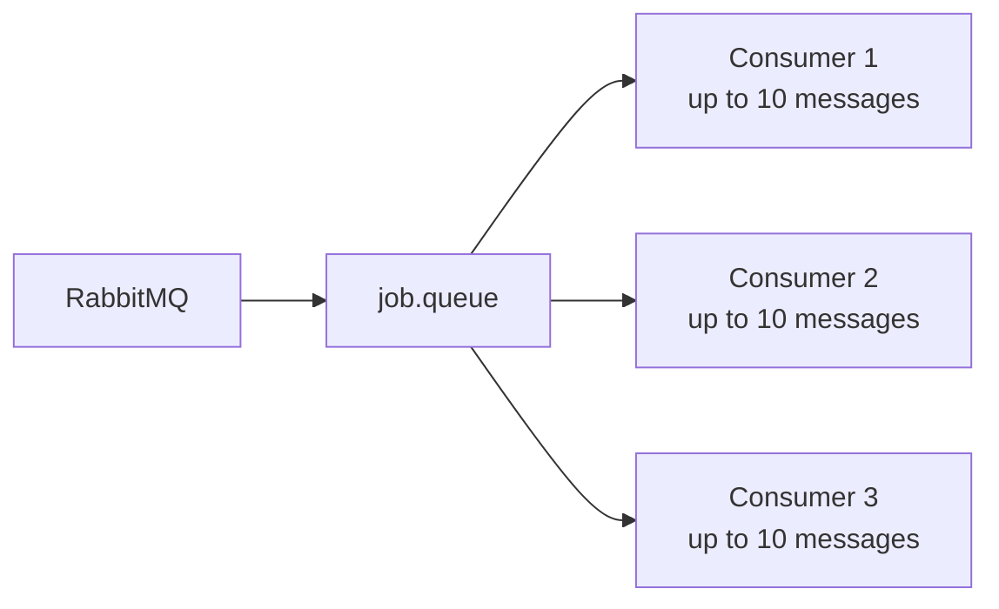

### Consumer Concurrency

Configured with:

```yaml
concurrency: 2
max-concurrency: 5
```

The application can maintain a minimum of 2 consumers and scale up to 5 consumers depending on workload.

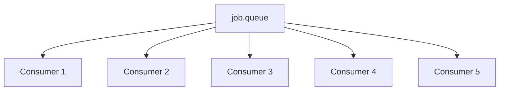

Concurrency increases processing throughput for workloads where individual jobs can be processed independently.


## Idempotency

RabbitMQ-based systems must account for duplicate message delivery.

Before processing a message, the consumer loads the corresponding job from PostgreSQL.

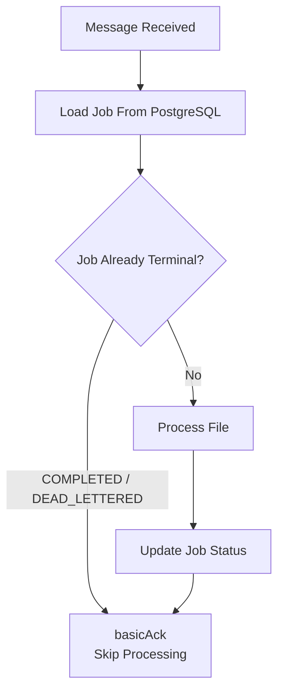

If the job is already:

* `COMPLETED`
* `DEAD_LETTERED`

the consumer acknowledges the message without processing the file again.

This prevents duplicate work when the same message is delivered more than once.


## Database Model

PostgreSQL stores three main types of information:

1. Uploaded file metadata
2. Processing job state
3. Job state transition history

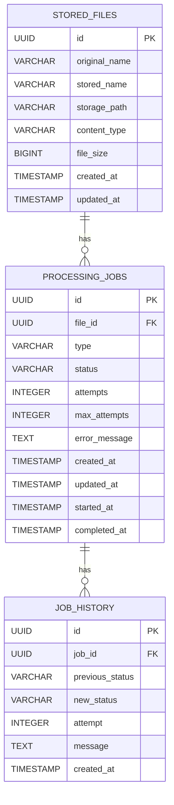

### `stored_files`

| Column          | Type         |
| --------------- | ------------ |
| `id`            | UUID         |
| `original_name` | VARCHAR(255) |
| `stored_name`   | VARCHAR(255) |
| `storage_path`  | VARCHAR(500) |
| `content_type`  | VARCHAR(100) |
| `file_size`     | BIGINT       |
| `created_at`    | TIMESTAMP    |
| `updated_at`    | TIMESTAMP    |

### `processing_jobs`

| Column          | Type        |
| --------------- | ----------- |
| `id`            | UUID        |
| `file_id`       | UUID        |
| `type`          | VARCHAR(50) |
| `status`        | VARCHAR(50) |
| `attempts`      | INTEGER     |
| `max_attempts`  | INTEGER     |
| `error_message` | TEXT        |
| `created_at`    | TIMESTAMP   |
| `updated_at`    | TIMESTAMP   |
| `started_at`    | TIMESTAMP   |
| `completed_at`  | TIMESTAMP   |

### `job_history`

| Column            | Type        |
| ----------------- | ----------- |
| `id`              | UUID        |
| `job_id`          | UUID        |
| `previous_status` | VARCHAR(50) |
| `new_status`      | VARCHAR(50) |
| `attempt`         | INTEGER     |
| `message`         | TEXT        |
| `created_at`      | TIMESTAMP   |

Flyway owns the database schema.

JPA schema generation is configured for validation rather than automatic schema creation:

```yaml
spring:
  jpa:
    hibernate:
      ddl-auto: validate
```


## API Documentation

### File APIs

| Method | Endpoint                   | Description       |
| ------ | -------------------------- | ----------------- |
| `POST` | `/api/files`               | Upload a file     |
| `GET`  | `/api/files`               | List all files    |
| `GET`  | `/api/files/{id}`          | Get file metadata |
| `GET`  | `/api/files/{id}/download` | Download file     |

### Job APIs

| Method | Endpoint                 | Description          |
| ------ | ------------------------ | -------------------- |
| `GET`  | `/api/jobs`              | List all jobs        |
| `GET`  | `/api/jobs/{id}`         | Get job              |
| `GET`  | `/api/jobs/{id}/history` | Get job history      |
| `POST` | `/api/jobs/{id}/retry`   | Manually retry a job |

### Upload File

```bash
curl -X POST http://localhost:8080/api/files \
  -F "file=@/path/to/report.pdf"
```

### Get File

```bash
curl http://localhost:8080/api/files/{id}
```

### Get Job

```bash
curl http://localhost:8080/api/jobs/{id}
```

### Get Job History

```bash
curl http://localhost:8080/api/jobs/{id}/history
```

### Manual Retry

```bash
curl -X POST http://localhost:8080/api/jobs/{id}/retry
```

### Download File

```bash
curl http://localhost:8080/api/files/{id}/download \
  -o downloaded.pdf
```


## Configuration

| Property                                    | Default                                          | Description                  |
| ------------------------------------------- | ------------------------------------------------ | ---------------------------- |
| `spring.rabbitmq.host`                      | `localhost`                                      | RabbitMQ host                |
| `spring.rabbitmq.port`                      | `5672`                                           | RabbitMQ AMQP port           |
| `SPRING_DATASOURCE_URL`                     | `jdbc:postgresql://localhost:5432/rabbitmq_demo` | PostgreSQL JDBC URL          |
| `SPRING_DATASOURCE_USERNAME`                | `postgres`                                       | PostgreSQL username          |
| `SPRING_DATASOURCE_PASSWORD`                | `postgres`                                       | PostgreSQL password          |
| `job.processing.delay-ms`                   | `3000`                                           | Simulated processing delay   |
| `job.processing.failure-rate`               | `0.3`                                            | Simulated failure rate       |
| `job.retry.delays`                          | `[5000, 15000, 45000]`                           | Retry delays                 |
| `file-storage.directory`                    | `./storage`                                      | Local file storage directory |
| `spring.servlet.multipart.max-file-size`    | `20MB`                                           | Maximum upload file size     |
| `spring.servlet.multipart.max-request-size` | `20MB`                                           | Maximum request size         |

### RabbitMQ Listener

```yaml
spring:
  rabbitmq:
    listener:
      simple:
        acknowledge-mode: manual
        concurrency: 2
        max-concurrency: 5
        prefetch: 10
```


## Local Setup

### Prerequisites

* Java 17+
* Maven
* PostgreSQL
* RabbitMQ

Docker can be used instead of installing PostgreSQL and RabbitMQ locally.

### Start Infrastructure

```bash
docker compose up -d
```

### Run Application

Using Maven:

```bash
./mvnw spring-boot:run
```

Or build the application:

```bash
./mvnw clean package
```

Then run:

```bash
java -jar target/*.jar
```


## Docker Setup

Start PostgreSQL and RabbitMQ:

```bash
docker compose up -d
```

Check running containers:

```bash
docker compose ps
```

Stop services:

```bash
docker compose down
```

Remove services and volumes:

```bash
docker compose down -v
```


## RabbitMQ Management UI

RabbitMQ Management UI is available at:

```text
http://localhost:15672
```

Default credentials:

```text
Username: guest
Password: guest
```

### Useful Sections

| Section     | Purpose                                           |
| ----------- | ------------------------------------------------- |
| Queues      | Inspect messages, consumers, and queue statistics |
| Exchanges   | Inspect exchanges and bindings                    |
| Connections | Inspect active RabbitMQ connections               |
| Channels    | Inspect channel activity                          |
| Admin       | Manage RabbitMQ configuration                     |

### Message Inspection

To inspect a message:

1. Open **Queues**
2. Select `job.queue`
3. Open **Get messages**
4. Inspect the message payload
5. Check the number of consumers
6. Inspect message acknowledgements

The same process can be used for:

```text
job.retry.5s
job.retry.15s
job.retry.45s
job.dlq
```


## Manual Verification

### 1. Upload a File

```bash
curl -X POST http://localhost:8080/api/files \
  -F "file=@/path/to/report.pdf"
```

The file should be created under:

```text
./storage/
```


### 2. Verify File Metadata

```bash
curl http://localhost:8080/api/files/{id}
```

Verify that PostgreSQL contains the uploaded file metadata.


### 3. Verify Job Creation

```bash
curl http://localhost:8080/api/jobs/{id}
```

The job should initially be:

```text
QUEUED
```


### 4. Observe RabbitMQ

Open:

```text
http://localhost:15672
```

Inspect:

```text
job.exchange
job.queue
```

The processing message should be routed from the exchange into the main queue.


### 5. Observe Consumer Processing

The consumer should load the job and transition it:

```text
QUEUED
    ↓
PROCESSING
    ↓
COMPLETED
```


### 6. Verify Job History

```bash
curl http://localhost:8080/api/jobs/{id}/history
```

The history should contain the state transitions performed by the consumer.


### 7. Trigger a Failure

The default processing failure rate is:

```text
30%
```

A failed processing attempt should produce:

```text
PROCESSING
    ↓
FAILED
    ↓
RETRYING
```


### 8. Observe Retry

The message should be routed through one of the retry queues:

```text
job.retry.5s
job.retry.15s
job.retry.45s
```

The message remains delayed until its TTL expires.


### 9. Verify Reprocessing

After the TTL expires:

```text
Retry Queue
     ↓
Dead Letter Exchange
     ↓
job.exchange
     ↓
job.queue
     ↓
Consumer
```

The consumer processes the job again with an increased attempt count.


### 10. Verify DLQ

After the maximum number of attempts:

```text
FAILED
   ↓
DEAD_LETTERED
   ↓
job.dlq
```

Inspect `job.dlq` through RabbitMQ Management UI.


### 11. Verify Idempotency

Send or deliver a duplicate message for an already completed job.

The consumer should:

```text
Load Job
   ↓
Check Status
   ↓
Already COMPLETED
   ↓
basicAck
```

The file should not be processed again.


### 12. Manual Retry

Retry a failed or dead-lettered job:

```bash
curl -X POST http://localhost:8080/api/jobs/{id}/retry
```

The job should return to:

```text
QUEUED
```

and a new processing message should be published.


### 13. Download File

```bash
curl http://localhost:8080/api/files/{id}/download \
  -o downloaded.pdf
```

The downloaded file should match the stored file.


## Synchronous vs Asynchronous Processing

### Synchronous Processing

Without RabbitMQ, the API could perform the processing directly inside the HTTP request.

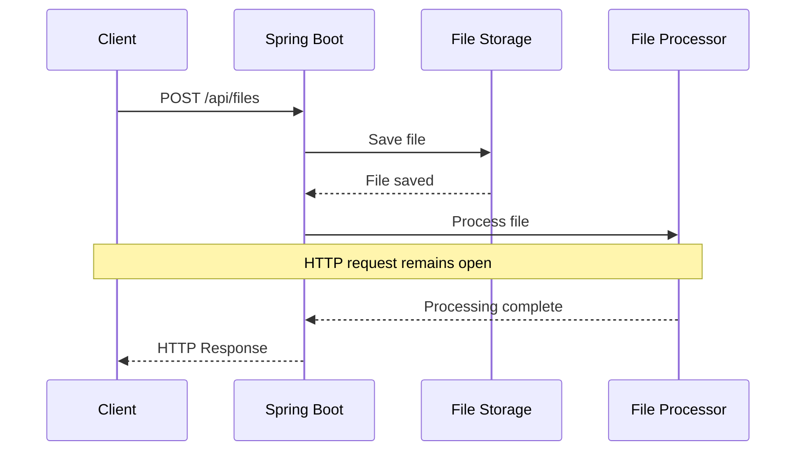

The client waits until processing finishes.


### Asynchronous Processing

This project moves the processing work to RabbitMQ.

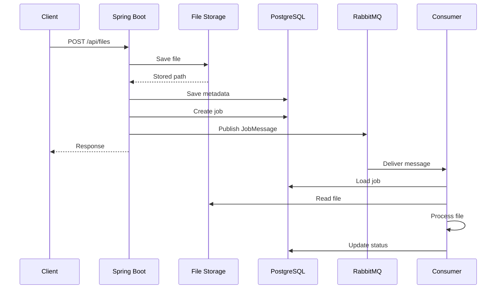

### Key Difference

```mermaid
graph LR

    subgraph Sync["Synchronous"]
        A["HTTP Request"] --> B["Save File"]
        B --> C["Process File"]
        C --> D["HTTP Response"]
    end

    subgraph Async["Asynchronous"]
        E["HTTP Request"] --> F["Save File"]
        F --> G["Create Job"]
        G --> H["Publish RabbitMQ"]
        H --> I["HTTP Response"]

        J["RabbitMQ"] --> K["Worker"]
        K --> L["Process File"]
    end
```

The asynchronous approach allows the HTTP API and file-processing worker to operate independently.


## End-to-End Processing Flow

The complete application flow can be summarized as:

```mermaid
flowchart TB

    START["Client Uploads File"]

    STORE["Store File<br/>./storage"]

    METADATA["Persist File Metadata<br/>PostgreSQL"]

    CREATE["Create Processing Job<br/>QUEUED"]

    PUBLISH["RabbitMQ Producer"]

    EXCHANGE["job.exchange"]

    QUEUE["job.queue"]

    CONSUMER["Job Consumer"]

    LOAD["Load Job + File"]

    PROCESS["Process File"]

    SUCCESS["COMPLETED"]

    FAILURE["FAILED"]

    RETRY["RETRYING"]

    RETRY_QUEUE["Delayed Retry Queue"]

    AGAIN["Process Again"]

    DEAD["DEAD_LETTERED"]

    DLQ["job.dlq"]

    START --> STORE
    STORE --> METADATA
    METADATA --> CREATE
    CREATE --> PUBLISH
    PUBLISH --> EXCHANGE
    EXCHANGE -->|"job.created"| QUEUE
    QUEUE --> CONSUMER
    CONSUMER --> LOAD
    LOAD --> PROCESS

    PROCESS -->|"Success"| SUCCESS
    PROCESS -->|"Failure"| FAILURE

    FAILURE --> RETRY
    RETRY --> RETRY_QUEUE
    RETRY_QUEUE -->|"TTL + DLX"| EXCHANGE

    EXCHANGE --> QUEUE
    QUEUE --> AGAIN
    AGAIN --> LOAD

    FAILURE -->|"Max Attempts"| DEAD
    DEAD --> DLQ
```


## Actuator and OpenAPI

### Actuator

Health:

```text
GET /actuator/health
```

Info:

```text
GET /actuator/info
```

### OpenAPI

Swagger UI:

```text
http://localhost:8080/swagger-ui.html
```

OpenAPI specification:

```text
http://localhost:8080/api-docs
```


## Docker Services

| Service             |    Port | Purpose                |
| ------------------- | ------: | ---------------------- |
| PostgreSQL          |  `5432` | Application database   |
| RabbitMQ            |  `5672` | AMQP message broker    |
| RabbitMQ Management | `15672` | RabbitMQ Management UI |


## What This Project Demonstrates

This project is designed to demonstrate that RabbitMQ is not simply being used as a queue for creating jobs.

The complete system separates:

```mermaid
graph LR

    FILE["Uploaded File"]
    STORAGE["File Storage"]

    METADATA["File Metadata"]
    DB["PostgreSQL"]

    JOB["Processing Job"]
    RABBIT["RabbitMQ"]

    WORKER["Background Worker"]
    PROCESS["File Processing"]

    FILE --> STORAGE

    FILE --> METADATA
    METADATA --> DB

    METADATA --> JOB
    JOB --> RABBIT
    RABBIT --> WORKER
    WORKER --> PROCESS

    PROCESS --> DB
```

### File Lifecycle

```text
Upload
  ↓
Store
  ↓
Metadata persisted
  ↓
Download when required
```

### Processing Lifecycle

```text
Job Created
  ↓
RabbitMQ
  ↓
Consumer
  ↓
Processing
  ↓
Completed
```

### Failure Lifecycle

```text
Processing
    ↓
Failure
    ↓
Retry
    ↓
TTL Delay
    ↓
RabbitMQ
    ↓
Processing Again
    ↓
...
    ↓
Maximum Attempts
    ↓
Dead Letter Queue
```

This separation allows the project to demonstrate the important characteristics of asynchronous systems:

* Decoupled producers and consumers
* Durable message delivery
* Explicit acknowledgement
* Controlled concurrency
* Prefetch management
* Delayed retry
* Dead-letter handling
* Idempotent processing
* Persistent job state
* Processing history
* Independent file storage
* Clear separation between API and background work


## License

MIT
