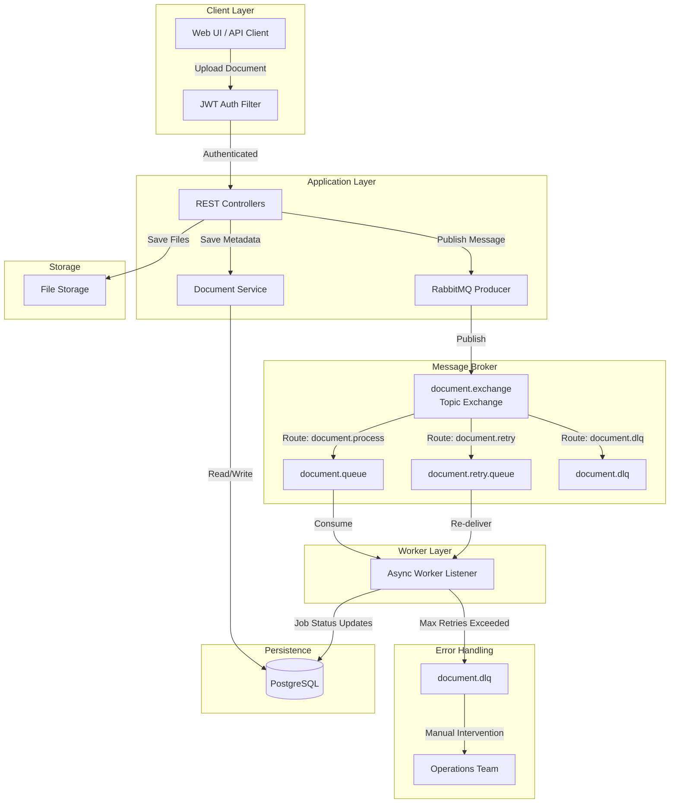
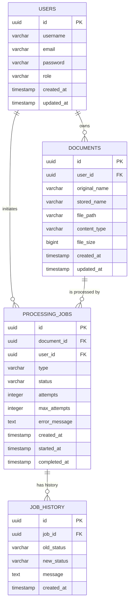

# Async Document Processing Platform - RabbitMQ

A Spring Boot 3.x + RabbitMQ based asynchronous document processing platform with JWT authentication, PostgreSQL persistence, and production-ready infrastructure.

## Table of Contents

- [Architecture](#architecture)
- [RabbitMQ Concepts](#rabbitmq-concepts)
- [Producer/Consumer Flow](#producerconsumer-flow)
- [Acknowledgement](#acknowledgement)
- [Retry with Exponential Backoff](#retry-with-exponential-backoff)
- [Dead Letter Queue (DLQ)](#dead-letter-queue-dlq)
- [Prefetch and Concurrency](#prefetch-and-concurrency)
- [Idempotency](#idempotency)
- [Database Model](#database-model)
- [API Documentation](#api-documentation)
- [Local Setup](#local-setup)
- [Docker Setup](#docker-setup)
- [RabbitMQ Management UI](#rabbitmq-management-ui)
- [Testing](#testing)

## Architecture



## RabbitMQ Concepts

### Exchange
- **Name**: `document.exchange`
- **Type**: Topic
- **Purpose**: Routes processing messages to appropriate queues based on routing keys

### Queues
| Queue | Purpose |
|-------|---------|
| `document.queue` | Primary queue for document processing jobs |
| `document.retry.queue` | Delayed queue for retry attempts with backoff |
| `document.dlq` | Dead letter queue for failed jobs after max retries |

### Routing Keys
| Routing Key | Queue | Usage |
|-------------|-------|-------|
| `document.process` | `document.queue` | Initial processing dispatch |
| `document.retry` | `document.retry.queue` | Retry after failure with backoff |
| `document.dlq` | `document.dlq` | Final failure destination |

### Bindings
- `document.exchange` → `document.process` → `document.queue`
- `document.exchange` → `document.retry` → `document.retry.queue`
- `document.exchange` → `document.dlq` → `document.dlq`

## Producer/Consumer Flow

1. **Client** uploads a document via REST API with JWT authentication
2. **Controller** saves file metadata to PostgreSQL and publishes message to `document.exchange`
3. **Exchange** routes message to `document.queue` using `document.process` routing key
4. **Consumer** picks up message, processes document (text extraction, OCR, etc.)
5. **ACK/NACK**: Consumer acknowledges successful processing or rejects with retry
6. **Retry Queue**: On failure, message is routed to `document.retry.queue` with exponential backoff
7. **DLQ**: After max retries (3 attempts), message goes to `document.dlq`

## Acknowledgement

- **Manual ACK**: Consumer sends `basicAck` after successful processing
- **NACK with requeue**: Consumer sends `basicNack` with `requeue=true` to return to queue for immediate retry
- **NACK without requeue**: Consumer sends `basicNack` with `requeue=false` to route to DLQ
- **Auto-ACK disabled**: All acks are manual for reliability

## Retry with Exponential Backoff

| Attempt | Backoff Delay | Total Delay |
|---------|---------------|-------------|
| 1 → 2 | 5 seconds | 5 seconds |
| 2 → 3 | 15 seconds | 20 seconds |
| 3 → DLQ | 45 seconds | 65 seconds |

- Message TTL is set based on retry attempt
- Dead letter exchange routes expired messages back to original queue
- `x-death` headers track retry count

## Dead Letter Queue (DLQ)

- Receives messages that exceed `max_attempts` (default: 3)
- Requires manual intervention or automated cleanup
- Provides message history and error details for debugging
- Can be re-queued for reprocessing after fixing root cause

## Prefetch and Concurrency

- **Prefetch**: 10 messages per consumer (unacknowledged message limit)
- **Concurrency**: 2-5 concurrent consumers (configurable via env vars)
- **Impact**: Controls memory usage and processing throughput
- **Tuning**: Adjust based on message processing time and system resources

## Idempotency

- All document operations use idempotency keys (document ID)
- Job status updates are tracked in `job_history` table
- Duplicate message detection via message ID deduplication
- Safe retries ensure no duplicate processing or side effects

## Database Model



## API Documentation

- **Swagger UI**: http://localhost:8080/swagger-ui.html
- **OpenAPI Spec**: http://localhost:8080/api-docs
- **Health**: http://localhost:8080/actuator/health
- **Metrics**: http://localhost:8080/actuator/metrics

## Local Setup

### Prerequisites
- Java 17+
- Maven 3.9+
- PostgreSQL 16+
- RabbitMQ 3.13+

### Steps

1. Clone the repository:
```bash
git clone <repository-url>
cd rabbitmq
```

2. Copy environment file:
```bash
cp .env.example .env
```

3. Update `.env` with your local configurations

4. Start PostgreSQL and RabbitMQ locally

5. Run database migrations (Flyway will auto-run on startup)

6. Build and run:
```bash
mvn clean install
mvn spring-boot:run
```

## Docker Setup

### Prerequisites
- Docker 20.10+
- Docker Compose 1.29+

### Steps

1. Copy environment file:
```bash
cp .env.example .env
```

2. Start all services:
```bash
docker-compose up --build
```

3. Access services:
- Application: http://localhost:8080
- RabbitMQ Management: http://localhost:15672

4. Stop services:
```bash
docker-compose down
```

5. Remove volumes (clean slate):
```bash
docker-compose down -v
```

## RabbitMQ Management UI

Access the RabbitMQ Management interface at:
- **URL**: http://localhost:15672
- **Username**: guest
- **Password**: guest

### Useful Sections

- **Queues**: View messages, consumers, and queue statistics
- **Exchanges**: Monitor routing and message flow
- **Connections**: See active client connections
- **Channels**: Monitor channel performance
- **Admin**: Manage users, vhosts, and policies

### Message Inspection

1. Go to **Queues** tab
2. Click on a queue (e.g., `document.queue`)
3. View **Get messages** to inspect payload
4. Use **Purge** to clear queue (careful!)
5. Use **Publish message** to test routing

## Testing

### Run All Tests
```bash
mvn test
```

### Run Specific Test Profile
```bash
mvn test -Dspring.profiles.active=test
```

### Integration Tests
```bash
mvn verify
```

### RabbitMQ Test Container
The test profile uses `application-test.yml` with:
- `ddl-auto: create-drop` for clean test database
- Separate test database URL
- Test JWT secrets

### API Testing
Use the Swagger UI at http://localhost:8080/swagger-ui.html for interactive API testing.

### Load Testing
```bash
# Install vegeta
go install github.com/tsenart/vegeta@latest

# Run load test
echo 'POST http://localhost:8080/api/documents/upload' | vegeta attack -rate=10 -duration=30s | vegeta report
```

## Environment Variables

| Variable | Description | Default |
|----------|-------------|---------|
| `SPRING_PROFILES_ACTIVE` | Active Spring profile | dev |
| `DATABASE_URL` | PostgreSQL JDBC URL | jdbc:postgresql://localhost:5432/document_processing |
| `DATABASE_USERNAME` | PostgreSQL username | postgres |
| `DATABASE_PASSWORD` | PostgreSQL password | postgres |
| `RABBITMQ_HOST` | RabbitMQ host | localhost |
| `RABBITMQ_PORT` | RabbitMQ port | 5672 |
| `RABBITMQ_USERNAME` | RabbitMQ username | guest |
| `RABBITMQ_PASSWORD` | RabbitMQ password | guest |
| `JWT_SECRET` | JWT signing secret | (required) |
| `JWT_EXPIRATION_MS` | JWT token expiration | 3600000 |
| `FILE_STORAGE_PATH` | File upload directory | ./uploads |
| `RABBITMQ_LISTENER_CONCURRENCY` | Min concurrent consumers | 2 |
| `RABBITMQ_LISTENER_MAX_CONCURRENCY` | Max concurrent consumers | 5 |
| `RABBITMQ_LISTENER_PREFETCH` | Messages per consumer | 10 |

## License

MIT License
