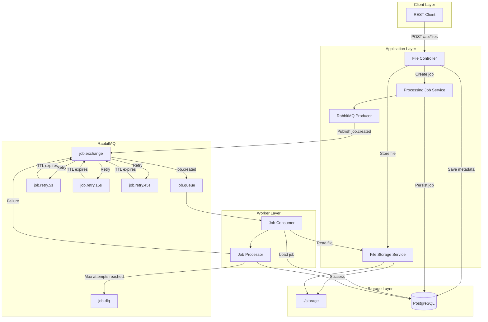
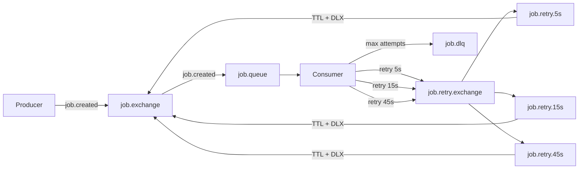
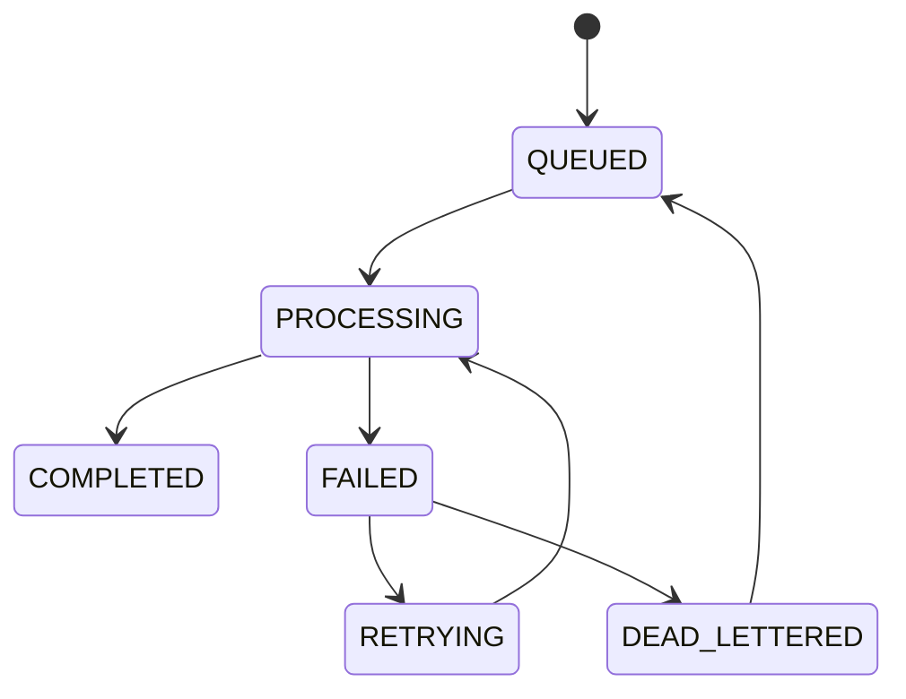
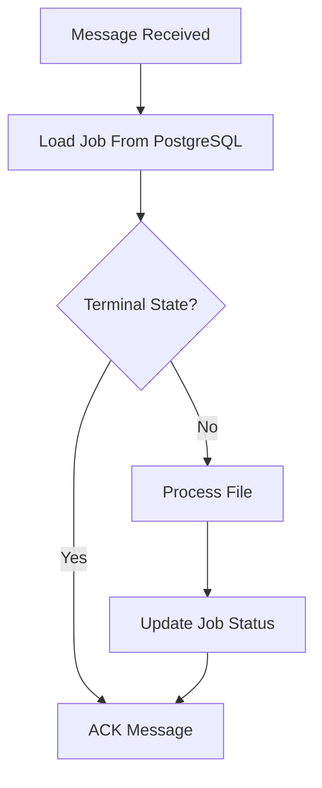
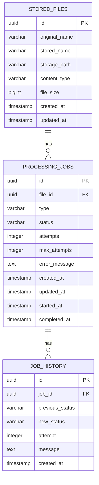

# Spring Boot RabbitMQ Async File Processing Demo

A Spring Boot 3.x + RabbitMQ asynchronous file processing learning platform that demonstrates how uploaded files can be stored independently from background processing.

The project uses **RabbitMQ for asynchronous job dispatch**, **PostgreSQL for file and processing metadata**, **local filesystem storage for uploaded files**, and **Flyway for database migrations**.

The primary goal is to demonstrate real-world RabbitMQ patterns such as producer/consumer communication, durable queues, routing keys, manual acknowledgements, consumer concurrency, prefetch, delayed retries, dead-letter queues, idempotent processing, and job state management.

---

## Table of Contents

* [Architecture](#architecture)
* [Core Concepts](#core-concepts)
* [RabbitMQ Topology](#rabbitmq-topology)
* [Producer and Consumer Flow](#producer-and-consumer-flow)
* [File Storage](#file-storage)
* [Job Lifecycle](#job-lifecycle)
* [Acknowledgement Strategy](#acknowledgement-strategy)
* [Retry and Backoff](#retry-and-backoff)
* [Dead Letter Queue](#dead-letter-queue)
* [Prefetch and Concurrency](#prefetch-and-concurrency)
* [Idempotency](#idempotency)
* [Database Model](#database-model)
* [API](#api)
* [Configuration](#configuration)
* [Local Setup](#local-setup)
* [Docker Setup](#docker-setup)
* [RabbitMQ Management UI](#rabbitmq-management-ui)
* [Manual Verification](#manual-verification)
* [Synchronous vs Asynchronous Processing](#synchronous-vs-asynchronous-processing)
* [Actuator and OpenAPI](#actuator-and-openapi)
* [Docker Services](#docker-services)
* [License](#license)

---

## Architecture

The application separates **file storage** from **file processing**.

Uploading a file does not perform the processing synchronously. The API stores the file, persists its metadata, creates a processing job, and publishes a message to RabbitMQ. A consumer later loads the file and performs the processing asynchronously.



### High-Level Flow

```text
Client
  │
  │ Upload file
  ▼
File Controller
  │
  ├──────────────► File Storage
  │                    │
  │                    ▼
  │                 ./storage
  │
  ├──────────────► PostgreSQL
  │                 File Metadata
  │
  ▼
Create Processing Job
  │
  ▼
RabbitMQ Producer
  │
  ▼
job.exchange
  │
  ▼
job.queue
  │
  ▼
Job Consumer
  │
  ├──► Load Job
  ├──► Load File
  └──► Process File
          │
          ├── Success ──► COMPLETED
          │
          └── Failure ──► Retry / DLQ
```

---

## Core Concepts

This project focuses on the following RabbitMQ and asynchronous-processing concepts:

| Concept                  | Demonstrated By                             |
| ------------------------ | ------------------------------------------- |
| Producer / Consumer      | Job producer and RabbitMQ consumer          |
| Exchange                 | `job.exchange`                              |
| Routing Keys             | `job.created`, retry and dead-letter routes |
| Durable Queues           | Main, retry and DLQ queues                  |
| Manual ACK               | Explicit `basicAck`                         |
| Prefetch                 | `prefetch: 10`                              |
| Concurrency              | 2–5 consumers                               |
| Retry                    | TTL-based delayed retry                     |
| Dead Letter Queue        | `job.dlq`                                   |
| Idempotency              | Job status validation                       |
| State Machine            | Processing job lifecycle                    |
| File Storage Abstraction | `FileStorageService`                        |
| Database Persistence     | PostgreSQL                                  |
| Schema Migration         | Flyway                                      |

---

## RabbitMQ Topology

### Exchange

| Name                 | Type   | Purpose                                         |
| -------------------- | ------ | ----------------------------------------------- |
| `job.exchange`       | Direct | Main exchange for processing and retry messages |
| `job.retry.exchange` | Direct | Routes retry messages to delayed retry queues   |

### Queues

| Queue           | Type    | Purpose                 |
| --------------- | ------- | ----------------------- |
| `job.queue`     | Durable | Main processing queue   |
| `job.retry.5s`  | Durable | 5-second delayed retry  |
| `job.retry.15s` | Durable | 15-second delayed retry |
| `job.retry.45s` | Durable | 45-second delayed retry |
| `job.dlq`       | Durable | Dead-letter queue       |

### Routing Keys

| Routing Key     | Destination     | Purpose            |
| --------------- | --------------- | ------------------ |
| `job.created`   | `job.queue`     | Initial processing |
| `job.retry.5s`  | `job.retry.5s`  | First retry        |
| `job.retry.15s` | `job.retry.15s` | Second retry       |
| `job.retry.45s` | `job.retry.45s` | Third retry        |
| `job.dead`      | `job.dlq`       | Final failure      |

### RabbitMQ Flow



---

## Producer and Consumer Flow

### Producer

The producer is responsible for publishing a processing message after the file and its metadata have been stored.

```text
POST /api/files
      │
      ▼
Validate Multipart File
      │
      ▼
Store File
      │
      ▼
Save File Metadata
      │
      ▼
Create Processing Job
      │
      ▼
Status = QUEUED
      │
      ▼
Publish JobMessage
      │
      ▼
job.exchange
      │
      ▼
job.queue
```

### Consumer

The consumer receives the message and performs the actual background processing.

```text
RabbitMQ
   │
   ▼
job.queue
   │
   ▼
Consumer
   │
   ▼
Load Processing Job
   │
   ▼
Check Current Status
   │
   ▼
Load File From Storage
   │
   ▼
Read File Bytes
   │
   ▼
JobProcessor
   │
   ├───────────────┐
   ▼               ▼
Success          Failure
   │               │
   ▼               ▼
COMPLETED       Retry?
                   │
             ┌─────┴─────┐
             ▼           ▼
            YES          NO
             │            │
             ▼            ▼
          RETRYING      DLQ
```

---

## File Storage

File storage is intentionally separated from processing.


The application uses a storage abstraction:

```text
FileStorageService
        │
        ▼
LocalFileStorageService
        │
        ▼
./storage/
```

Uploaded files are stored using UUID-based filenames.

The storage abstraction provides a clean boundary between the application and the physical storage implementation. The current implementation uses the local filesystem, while the same interface can later be implemented with an object-storage provider such as S3.

---

## Job Lifecycle

Every uploaded file gets an associated processing job.

### Job State Machine



### Valid State Transitions

| From            | To              |
| --------------- | --------------- |
| `QUEUED`        | `PROCESSING`    |
| `PROCESSING`    | `COMPLETED`     |
| `PROCESSING`    | `FAILED`        |
| `FAILED`        | `RETRYING`      |
| `FAILED`        | `DEAD_LETTERED` |
| `RETRYING`      | `PROCESSING`    |
| `DEAD_LETTERED` | `QUEUED`        |

Invalid transitions result in `InvalidStateTransitionException`.

---

## Acknowledgement Strategy

The RabbitMQ consumer uses:

```text
ackMode = MANUAL
```

Messages are explicitly acknowledged by the consumer.

### Successful Processing

```text
Message received
      │
      ▼
Process job
      │
      ▼
COMPLETED
      │
      ▼
basicAck
```

### Retry

The original message is acknowledged after a retry message has been successfully scheduled.

```text
Message received
      │
      ▼
Processing fails
      │
      ▼
Publish retry message
      │
      ▼
basicAck original message
```

### Dead Letter

When the maximum number of attempts has been reached:

```text
Message received
      │
      ▼
Max attempts reached
      │
      ▼
Status = DEAD_LETTERED
      │
      ▼
Publish to job.dlq
      │
      ▼
basicAck original message
```

This approach avoids uncontrolled `requeue=true` loops.

---

## Retry and Backoff

The project uses delayed retry queues backed by RabbitMQ TTL and dead-letter routing.

| Retry        |      Delay |
| ------------ | ---------: |
| First retry  |  5 seconds |
| Second retry | 15 seconds |
| Third retry  | 45 seconds |

### Retry Flow

```text
Processing Failure
       │
       ▼
attempt < maxAttempts?
       │
   ┌───┴───┐
   │       │
  YES      NO
   │       │
   ▼       ▼
RETRYING  DEAD_LETTERED
   │
   ▼
job.retry.exchange
   │
   ├──► job.retry.5s
   │
   ├──► job.retry.15s
   │
   └──► job.retry.45s
            │
            ▼
       TTL expires
            │
            ▼
       Dead-letter
            │
            ▼
      job.exchange
            │
            ▼
        job.queue
            │
            ▼
       Process again
```

The retry delay is selected based on the current attempt.

---

## Dead Letter Queue

The dead-letter queue is the final destination for jobs that cannot be successfully processed within the configured retry limit.

```text
job.queue
    │
    ▼
Processing
    │
    ▼
Failure
    │
    ▼
Retry
    │
    ▼
Failure
    │
    ▼
Maximum Attempts
    │
    ▼
job.dlq
```

The `job.dlq` queue allows failed messages to be inspected instead of repeatedly requeued.

Jobs reaching this state are persisted as:

```text
DEAD_LETTERED
```

They can also be manually retried through the API.

---

## Prefetch and Concurrency

### Prefetch

Configured with:

```yaml
spring.rabbitmq.listener.simple.prefetch: 10
```

A consumer can receive up to 10 unacknowledged messages before RabbitMQ delivers additional messages.

Prefetch controls the number of in-flight messages and can affect both memory usage and workload distribution.

### Consumer Concurrency

Configured with:

```yaml
concurrency: 2
max-concurrency: 5
```

This allows the application to run between 2 and 5 consumers.

```text
RabbitMQ
    │
    ▼
job.queue
    │
    ├──► Consumer 1
    ├──► Consumer 2
    ├──► Consumer 3
    ├──► Consumer 4
    └──► Consumer 5
```

RabbitMQ distributes available messages across the active consumers.

---

## Idempotency

RabbitMQ systems must account for duplicate message delivery.

The consumer loads the processing job from PostgreSQL before performing work.

If the job has already reached a terminal state:

```text
COMPLETED
```

or:

```text
DEAD_LETTERED
```

the message is acknowledged without processing the file again.



This prevents duplicate processing when the same job message is delivered more than once.

---

## Database Model

The application uses PostgreSQL for file metadata, processing jobs, and job history.



### `stored_files`

| Column          | Type         |
| --------------- | ------------ |
| `id`            | UUID         |
| `original_name` | VARCHAR(255) |
| `stored_name`   | VARCHAR(255) |
| `storage_path`  | VARCHAR(500) |
| `content_type`  | VARCHAR(100) |
| `file_size`     | BIGINT       |
| `created_at`    | TIMESTAMP    |
| `updated_at`    | TIMESTAMP    |

### `processing_jobs`

| Column          | Type        |
| --------------- | ----------- |
| `id`            | UUID        |
| `file_id`       | UUID        |
| `type`          | VARCHAR(50) |
| `status`        | VARCHAR(50) |
| `attempts`      | INTEGER     |
| `max_attempts`  | INTEGER     |
| `error_message` | TEXT        |
| `created_at`    | TIMESTAMP   |
| `updated_at`    | TIMESTAMP   |
| `started_at`    | TIMESTAMP   |
| `completed_at`  | TIMESTAMP   |

### `job_history`

| Column            | Type        |
| ----------------- | ----------- |
| `id`              | UUID        |
| `job_id`          | UUID        |
| `previous_status` | VARCHAR(50) |
| `new_status`      | VARCHAR(50) |
| `attempt`         | INTEGER     |
| `message`         | TEXT        |
| `created_at`      | TIMESTAMP   |

Flyway owns the database schema and JPA uses:

```yaml
ddl-auto: validate
```

---

## API

| Method | Endpoint                   | Description                 |
| ------ | -------------------------- | --------------------------- |
| `POST` | `/api/files`               | Upload a file               |
| `GET`  | `/api/files`               | List all files              |
| `GET`  | `/api/files/{id}`          | Get file metadata           |
| `GET`  | `/api/files/{id}/download` | Download a file             |
| `GET`  | `/api/jobs/{id}`           | Get processing job          |
| `GET`  | `/api/jobs/{id}/history`   | Get job history             |
| `GET`  | `/api/jobs`                | List all processing jobs    |
| `POST` | `/api/jobs/{id}/retry`     | Manually retry a failed job |

### Upload File

```bash
curl -X POST http://localhost:8080/api/files \
  -F "file=@/path/to/report.pdf"
```

The endpoint stores the file and creates an asynchronous processing job.

### Get Job

```bash
curl http://localhost:8080/api/jobs/{id}
```

### Get Job History

```bash
curl http://localhost:8080/api/jobs/{id}/history
```

### Manual Retry

```bash
curl -X POST http://localhost:8080/api/jobs/{id}/retry
```

A manual retry resets a `FAILED` or `DEAD_LETTERED` job and places it back into the processing flow.

### Download File

```bash
curl http://localhost:8080/api/files/{id}/download \
  -o downloaded.pdf
```

---

## Configuration

| Property                                    | Default                                          | Description                   |
| ------------------------------------------- | ------------------------------------------------ | ----------------------------- |
| `spring.rabbitmq.host`                      | `localhost`                                      | RabbitMQ host                 |
| `spring.rabbitmq.port`                      | `5672`                                           | RabbitMQ port                 |
| `SPRING_DATASOURCE_URL`                     | `jdbc:postgresql://localhost:5432/rabbitmq_demo` | PostgreSQL JDBC URL           |
| `SPRING_DATASOURCE_USERNAME`                | `postgres`                                       | PostgreSQL username           |
| `SPRING_DATASOURCE_PASSWORD`                | `postgres`                                       | PostgreSQL password           |
| `job.processing.delay-ms`                   | `3000`                                           | Simulated processing delay    |
| `job.processing.failure-rate`               | `0.3`                                            | Simulated failure probability |
| `job.retry.delays`                          | `[5000, 15000, 45000]`                           | Retry delays                  |
| `file-storage.directory`                    | `./storage`                                      | Local storage directory       |
| `spring.servlet.multipart.max-file-size`    | `20MB`                                           | Maximum file size             |
| `spring.servlet.multipart.max-request-size` | `20MB`                                           | Maximum request size          |

---

## Local Setup

### Prerequisites

* Java 17+
* Maven
* PostgreSQL
* RabbitMQ
* Docker and Docker Compose (optional)

### Start Infrastructure

```bash
docker compose up -d
```

### Run the Application

```bash
./mvnw spring-boot:run
```

Or build and run the JAR:

```bash
./mvnw clean package

java -jar target/*.jar
```

---

## Docker Setup

The project provides Docker Compose services for PostgreSQL and RabbitMQ.

```bash
docker compose up -d
```

Check running services:

```bash
docker compose ps
```

Stop services:

```bash
docker compose down
```

To remove volumes as well:

```bash
docker compose down -v
```

---

## RabbitMQ Management UI

RabbitMQ Management UI:

```text
http://localhost:15672
```

Default credentials:

```text
Username: guest
Password: guest
```

### Useful Sections

| Section     | Purpose                        |
| ----------- | ------------------------------ |
| Queues      | Inspect messages and consumers |
| Exchanges   | Inspect exchanges and bindings |
| Connections | View active connections        |
| Channels    | Monitor RabbitMQ channels      |
| Admin       | Manage broker configuration    |

### What to Observe

After uploading a file:

1. Open **Queues**.
2. Inspect `job.queue`.
3. Inspect the consumer count.
4. Open **Exchanges**.
5. Inspect `job.exchange`.
6. Trigger a processing failure.
7. Observe the retry queue.
8. Observe the message returning after TTL expiry.
9. Inspect `job.dlq` after maximum attempts.

---

## Manual Verification

### 1. Upload a File

```bash
curl -X POST http://localhost:8080/api/files \
  -F "file=@/path/to/report.pdf"
```

The file should appear in:

```text
./storage/
```

### 2. Verify File Metadata

```bash
curl http://localhost:8080/api/files/{id}
```

### 3. Verify Job Creation

```bash
curl http://localhost:8080/api/jobs/{id}
```

The initial state should be:

```text
QUEUED
```

### 4. Observe Consumer Processing

The consumer should transition the job through:

```text
QUEUED
   ↓
PROCESSING
   ↓
COMPLETED
```

### 5. Verify Job History

```bash
curl http://localhost:8080/api/jobs/{id}/history
```

### 6. Trigger Failure

The default simulated failure rate is:

```text
30%
```

A failed job should move to:

```text
FAILED
   ↓
RETRYING
```

### 7. Observe Retry

The retry message is routed to the appropriate delayed queue:

```text
job.retry.5s
job.retry.15s
job.retry.45s
```

After the TTL expires, the message is routed back to the main processing flow.

### 8. Verify DLQ

After the maximum number of attempts:

```text
DEAD_LETTERED
```

The message should appear in:

```text
job.dlq
```

### 9. Verify Idempotency

If a duplicate message is delivered for a completed job, the consumer should acknowledge it without processing the file again.

### 10. Download the File

```bash
curl http://localhost:8080/api/files/{id}/download \
  -o downloaded.pdf
```

---

## Synchronous vs Asynchronous Processing

### Synchronous Processing

A traditional synchronous implementation would keep the HTTP request open while the file is processed.

```text
POST /api/files
       │
       ▼
Save File
       │
       ▼
Process File
       │
       ▼
Wait
       │
       ▼
HTTP Response
```

The client remains blocked until processing finishes.

---

### Asynchronous Processing

This project moves processing out of the HTTP request.

```text
POST /api/files
       │
       ▼
Save File
       │
       ▼
Save Metadata
       │
       ▼
Create Job
       │
       ▼
Publish RabbitMQ Message
       │
       ▼
Return HTTP Response
```

The background worker then performs the actual processing:

```text
RabbitMQ
    │
    ▼
job.queue
    │
    ▼
Consumer
    │
    ▼
Load File
    │
    ▼
Process File
    │
    ├──► COMPLETED
    │
    └──► RETRY / DLQ
```

This separation is the central architectural concept demonstrated by the project.

---

## Actuator and OpenAPI

### Actuator

Health endpoint:

```text
GET /actuator/health
```

Info endpoint:

```text
GET /actuator/info
```

### OpenAPI

Swagger UI:

```text
http://localhost:8080/swagger-ui.html
```

OpenAPI specification:

```text
http://localhost:8080/api-docs
```

---

## Docker Services

| Service             |    Port | Purpose                |
| ------------------- | ------: | ---------------------- |
| PostgreSQL          |  `5432` | Application database   |
| RabbitMQ            |  `5672` | AMQP broker            |
| RabbitMQ Management | `15672` | RabbitMQ web interface |

---

## What This Project Demonstrates

The project intentionally goes beyond simply putting a message into RabbitMQ.

It demonstrates the complete asynchronous processing lifecycle:

```text
File Upload
    │
    ▼
File Storage
    │
    ▼
Database Metadata
    │
    ▼
Job Creation
    │
    ▼
RabbitMQ Producer
    │
    ▼
Exchange
    │
    ▼
Durable Queue
    │
    ▼
Concurrent Consumer
    │
    ▼
File Processing
    │
    ├───────────────┐
    ▼               ▼
 Success          Failure
    │               │
    ▼               ▼
 COMPLETED       Retry
                    │
                    ▼
                   TTL
                    │
                    ▼
                 Requeue
                    │
                    ▼
              Process Again
                    │
                    ▼
              Maximum Attempts
                    │
                    ▼
                   DLQ
```

The important separation is:

```text
FILE LIFECYCLE
    File
      │
      ▼
  File Storage
      │
      ▼
 PostgreSQL Metadata


PROCESSING LIFECYCLE
    Processing Job
          │
          ▼
      RabbitMQ
          │
          ▼
       Consumer
          │
          ▼
     File Processing
          │
     ┌────┴────┐
     ▼         ▼
  Success    Failure
               │
          Retry / DLQ
```

The file itself is stored independently of the RabbitMQ message. RabbitMQ carries the processing instruction, while PostgreSQL tracks the processing state and the filesystem stores the actual file.

---

## License

MIT
